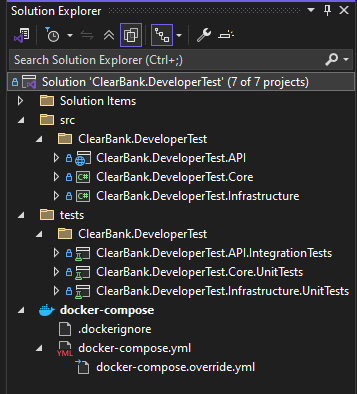
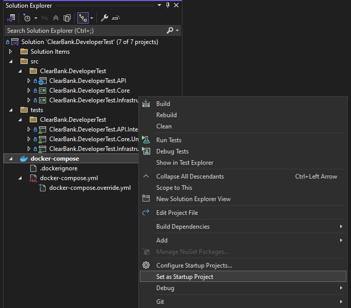
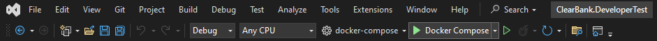
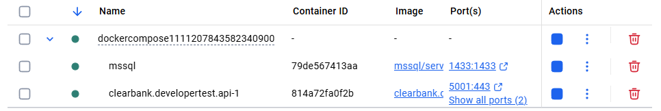
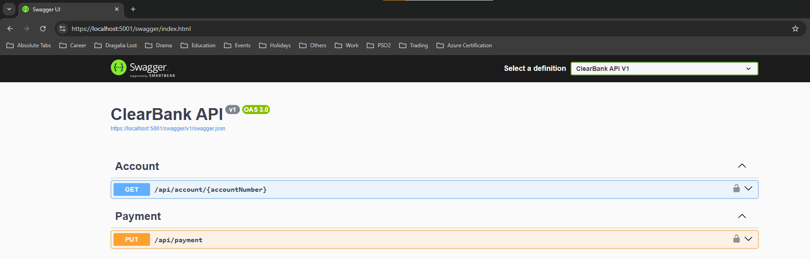
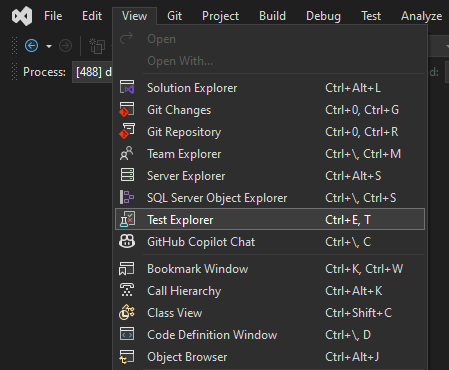
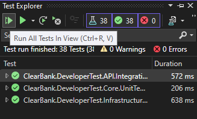

# ClearBank Developer Test

[](https://www.repostatus.org/#wip)


## Programs to Install

- [x] Docker Desktop
- [x] Git
- [x] Visual Studio
- [x] Azure Data Studio (To visualise the database)

## Setup Instructions

Clone the repository by navigating to your directory of choice and running the following git command `git clone https://github.com/Soup-Dumpling/clearbank-tech-test-dotnet.git`.

After cloning the repository, open the `ClearBank.DeveloperTest.sln` solution file in Visual Studio. Below you can see the full `ClearBank.DeveloperTest.sln` solution opened in Visual Studio:



## Configuration

### Docker Compose

In order to run the project using Docker Compose on Visual Studio you must set the docker-compose project as a start up project and add a local file **docker-compose.override.yml** to the root directory of the project as follows:\
**Note**: Replace values within () and make sure to remove the brackets

| Variable           | Description                                                                                                                                       |
| ------------------ | ------------------------------------------------------------------------------------------------------------------------------------------------- |
| SA Password        | Password for SQL Server Image                                                                                                                     |
| Volume Bind Source | Location on your computer to bind SQL database to e.g. For Linux or macOS systems /Users/john/app/data and Windows systems C:/Users/john/app/data |

### Docker Compose Override

```
services:
  sqldata:
    environment:
      - SA_PASSWORD=(SA Password)
      - MSSQL_PID=Developer
      - ACCEPT_EULA=Y
    volumes:
      - type: bind
        source: (Volume Bind Source)
        target: /var/opt/mssql/data
  clearbank.developertest.api:
    volumes:
      - ${APPDATA}/ASP.NET/Https:/root/.aspnet/https:ro
    environment:
      - ConnectionStrings__DefaultConnection=Server=sqldata;Database=ClearBank_DeveloperTest;User Id=sa;Password=(SA Password);TrustServerCertificate=true
```

### Visual Studio

Make sure the Docker Compose project is set as the default startup project. Right-click on the docker-compose node in the Project Explorer, and select the _Set as StartUp Project_ menu option:



Now you can build and run the application by pressing the Debug button in the toolbar:



After the Docker container has spun up in Docker desktop, it will be displayed as follows:



Then, you can access the project endpoints using the Swagger UI at https://localhost:5001/swagger/index.html



### Frameworks / Packages Used

| Framework / Package | Purpose                              |
| ------------------- | ------------------------------------ |
| XUnit               | Unit Testing                         |
| NSubstitute         | Fakes/Mocks/Substitutes              |
| Alba                | Integration Testing                  |
| Swashbuckle         | OpenAPI doc                          |
| Mediatr             | Mediator + Request/Response Handling |
| FluentValidation    | Validation                           |

### Core Endpoints

| Endpoint                     | Purpose             |
| ---------------------------- | ------------------- |
| /api/account/{accountNumber} | Get Account Details |
| /api/payment                 | Make Payment        |
| /api/health                  | Healthy / Unhealthy |

### Environments - ClearBank

| Environment | Url                    |
| ----------- | ---------------------- |
| Local       | https://localhost:5001 |

### About each project in solution

| Project                                | Description                                                                                    |
| -------------------------------------- | ---------------------------------------------------------------------------------------------- |
| ClearBank.DeveloperTest.API            | User Interface - Create your endpoints related to ClearBank service here                       |
| ClearBank.DeveloperTest.Core           | Business Logic Layer - Core of the ClearBank service - including use cases, domain and context |
| ClearBank.DeveloperTest.Infrastructure | Data Access Layer - Where all the implementation of ClearBank service, repos, providers go     |

### Running the test cases

In order to run the test cases in the tests directory, click on **View -> Test Explorer** as shown below:



Once the Test Explorer panel opens, click the first green play button that runs _All Tests In View_



## Approach to the technical challenge

In terms of architectural decisions, I divided the codebase into three layers each with their own responsibilities:

- Controller/User Interface - Receives request and passes it along to the Use Cases. Depending on the type of request, a response can be returned
- Use Cases - Applies business rules and logic
- Repository - Communicates with the database (adding, retrieving, updating and deleting records only)

In doing so I apply Clean architecture and N-layer architecture.

To follow the SOLID principles, each use case has only one responsibility. In each use case, both the business logic layer and data access layer depend on abstractions specifically interfaces. That way it prevents the business logic layer from depending on methods that it does not use and is instead segregated on a need-to-know basis. Additionally, by having low-level modules (data access layer/repository) depend on interface ensures that the data access layer adheres to the blueprint methods laid out in the interface that tell which data layer methods the use case handler has access to.

### Make Payment

Assumptions and Conditions for a Valid Payment:

- In a debtor - creditor relationship, a payment flows from the debtor to the creditor
- Both creditor and debtor accounts must be present in the database for a valid payment to occur
- The creditor account status must be either AccountStatus.InboundPaymentsOnly OR AccountStatus.Live
- The debtor account status must be AccountStatus.Live. If the debtor account status is AccountStatus.InboundPaymentsOnly then it can only receive funds and not send funds to another account
- The debtor account balance must be greater than or equal to the requested payment amount, otherwise the account would have insufficient funds for the payment
- Both creditor and debtor accounts must be subscribed to the payment scheme that the payment is being sent through, otherwise the payment cannot go through
- If either creditor or debtor accounts are not subscribed to a payment scheme then the payment cannot go through
- The payment must be today or in the future, it cannot be in the past. For example, yesterday or last week. Otherwise, the payment is invalid

### Account Table

| AccountNumber | Balance  | Status              | AllowedPaymentSchemes       |
| ------------- | -------- | ------------------- | --------------------------- |
| 08845741      | 32987.65 | Live                | None                        |
| 09773439      | 3109.87  | Live                | Chaps                       |
| 14653248      | -250.50  | InboundPaymentsOnly | FasterPayments              |
| 23992701      | 89012.34 | Live                | FasterPayments, Chaps       |
| 31022756      | 56789.01 | Live                | Bacs, Chaps                 |
| 36946349      | -750.25  | InboundPaymentsOnly | Bacs                        |
| 45302248      | 21098.76 | Live                | Bacs                        |
| 55694617      | 43210.98 | Live                | FasterPayments, Bacs, Chaps |
| 57047920      | 2678.90  | Live                | FasterPayments, Bacs        |
| 65015197      | 8432.10  | Disabled            | FasterPayments, Bacs        |
| 74000307      | -1500.75 | InboundPaymentsOnly | FasterPayments, Bacs, Chaps |
| 94202716      | 63254.88 | Live                | FasterPayments              |
| 99636544      | 58327.56 | Disabled            | FasterPayments, Bacs, Chaps |

### Demo Example - Valid Payment

Scenario:

- Creditor Account - 23992701
- Debtor Account - 31022756
- Payment Amount - 10000.00
- Payment Scheme - Chaps

https://github.com/user-attachments/assets/3abda566-811f-4980-91f2-7154f8468d2e

### Demo Example - Invalid Payment

Scenario: Debtor Account Payment Scheme Mismatch (e.g., trying to FasterPayments from a BACS-only debtor)

- Creditor Account - 74000307
- Debtor Account - 45302248
- Payment Amount - 10000.00
- Payment Scheme - FasterPayments

https://github.com/user-attachments/assets/7235aafe-93db-479f-97af-5950cff74719

### Future implementation

- To allow an account holder to deposit funds into the account.
- To allow an account holder to withdraw funds from the account.
